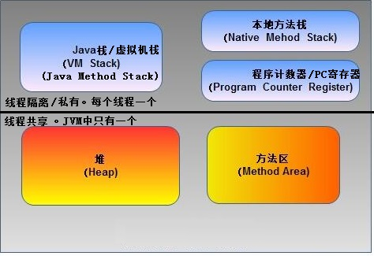

# 一、运行时数据区 Runtime Data Area #

**1. 程序计数器**

任一时刻，一个CPU的内核只会执行一条线程中的指令，因此，为了能够使得每个线程都在线程切换后能够恢复切换之前的程序执行位置，每个线程都需要有自己独立的程序计数器，不能互相被干扰，否则就会影响到程序的正常执行次序

如果线程执行的是非native方法，则程序计数器中保存的是当前需要执行的指令的地址；如果线程执行的是native方法，则程序计数器中的值是undefined。

所占空间的大小不会随程序的执行而发生改变，因此，对于程序计数器是不会发生内存溢出现象(OutOfMemory)

**2. Java栈**

就是我们常常所说的栈。

为执行Java方法(字节码)服务的，是Java方法执行的内存模型

每个线程正在执行的方法可能不同，因此每个线程都会有一个自己的Java栈，互不干扰。

Java栈中存放的是一个个的栈帧，每个栈帧对应一个被调用的方法

当线程执行一个方法时，就会随之创建一个对应的栈帧，并将建立的栈帧压栈。当方法执行完毕之后，便会将栈帧出栈。

规定了两种异常：

- 线程请求的栈深度大于虚拟机所允许的深度，将抛出StackOverflowError异常。
- 虚拟机扩展时无法申请到足够的内存，将抛出OutOfMemoryError异常(堆和方法区也会抛出OOM)

**3. 本地方法栈**

为执行本地方法（Native Method）服务的

VM规范并没有对本地方法栈的具体实现方法以及数据结构作强制规定，虚拟机可以自由实现它。

HotSopt虚拟机直接就把本地方法栈和Java栈合二为一。

会抛出StackOverflowError和OutOfMemoryErroy异常

**4.堆**

C语言中，堆是程序员唯一可以管理的内存区域。程序员可以通过malloc函数和free函数在堆上申请和释放空间

Java中的堆是用来存储**对象实例以及数组**（当然，数组引用是存放在Java栈中）。

Java**垃圾收集器**管理的主要区域

Java堆细分为新生代和老年代(为了更好的管理内存)

**5.方法区**

存储了每个**类的信息(类名称、方法信息、字段信息、接口信息)、静态变量、常量、运行时常量池以及编译器编译后的代码**等

运行时常量池：

- 加载 Class文件常量池
	- 储编译期间生成的字面常量和符号引用
- 运行期间放入的
	- 比如String的intern方法，就能将常量放入运行时常量池

JVM规范中，**不强制要求实现垃圾回收**。

很多人习惯将方法区称为“永久代”，是因为HotSpot虚拟机以**永久代**来实现方法区，从而JVM的垃圾收集器可以像管理堆区一样管理这部分区域，从而不需要专门为这部分设计垃圾回收机制。

不过自从JDK7之后，Hotspot虚拟机便将运行时常量池从永久代移除了。

# 二、对象 #

hotspot虚拟机为例

**2.1 对象的创建**

**1.检查** 

检查new指令的参数能否在常量池中定位到一个类的符号引用

检查这个符号引用代表的类是否已经被加载、解析和初始化过。如果没有，执行相应的类加载过程

**2.分配内存** 

为新生对象分配内存

假设Java堆中内存是绝对规整的，所有用过的内存放在一遍，空闲的内存放在另一边，中间放着一个指针作为分界点的指示器，那所分配内存就仅仅是把那个指针指向空闲空间那边挪动一段与对象大小相等的距离，这个分配方式叫做“**指针碰撞**”

如果Java堆中的内存并不是规整的，已使用的内存和空闲的内存相互交错，那就没办法简单地进行指针碰撞了，虚拟机就必须维护一个列表，记录上哪些内存块是可用的，在分配的时候从列表中找到一块足够大的空间划分给对象实例，并更新列表上的记录，这种分配方式成为“**空闲列表**”

选择那种分配方式由Java堆是否规整决定，而Java堆是否规整又由所采用的垃圾收集器是否带有压缩整理功能决定。

**3. Init**

执行new指令之后会接着执行Init方法，进行初始化，这样一个对象才算产生出来

**2.2 对象的内存布局**

对象在内存中储存的布局可以分为3块区域：

- 对象头。包括两部分：
	- 对象自身的运行时数据，如哈希码、GC分代年龄、锁状态标志、线程持有的锁、偏向线程ID、偏向时间戳
	- 类型指针，即对象指向它的类元数据的指针，虚拟机通过这个来确定对象是哪个类的实例
- 实例数据
- 对齐填充

**2.3 对象的访问定位**

- 使用句柄访问
	- reference存储的是对象的句柄地址(Java堆中有句柄池)
	- 句柄中包含了对象实例数据与类型数据各自的具体地址
	- 优势:对象被移动(垃圾收集时移动对象是非常普遍的行为)时只会改变句柄中的实例数据指针，而reference本身不需要修改
- 使用直接指针访问
	-refreence存储的直接就是对象的地址
	- Java堆对象的布局必须考虑如何访问类型数据的相关信息
	- 优势：速度更快，节省了一次指针定位的时间开销

# 三、OutOfMemoryError 异常 #

3.1 Java堆溢出

检查虚拟机的堆参数（-Xmx与-Xms），与机器物理内存对比看是否还可以调大

3.2 虚拟机栈和本地方法栈溢出

3.3 方法区和运行时常量池溢出

由于常量池分配在永久代中，可以通过-XX:PermSize和-XX:MaxPermSize限制方法区大小，从而间接限制其中常量池的容量。

# 四、垃圾收集 #

**1.判断对象存活**

**4.1.1 引用计数器法**

给对象添加一个引用计数器，每当由一个地方引用它时，计数器值就加1；当引用失效时，计数器值就减1；任何时刻计数器为0的对象就是不可能再被使用的

**4.1.2 可达性分析算法**

通过一系列的“GC Roots”对象作为起始点，从这些节点开始向下搜索，搜索所走过的路径成为引用链，当一个对象到GC ROOTS没有任何引用链相连时，则证明此对象时不可用的

Java语言中GC Roots对象包括下面几种：

1.虚拟机栈（栈帧中的**本地变量**表）中引用的对象

2.本地方法栈**JNI**（Native方法）引用的对象

3.方法区中**类静态成员**引用的对象

4.方法区中**常量**引用的对象

**2.对象引用**

- 强引用
	- Object obj 
	- 垃圾收集器永远不会回收掉被强引用引用的对象

- 软引用
	- SoftReference<Object> sf = new SoftReference<Object>(obj);
	- 用于缓存数据。内存不足自动回收，如果这次回收还没有足够的内存才会抛出内存溢出异常

			Object obj = new Object();
			SoftReference<Object> sf = new SoftReference<Object>(obj);
			obj = null;
			sf.get();//有时候会返回null
- 弱引用
	- WeakReference<Object> wf
	- 用于监控对象是否已经被垃圾回收器标记为即将回收的垃圾。无论当前内存是否足够都会回收掉只被弱引用关联的对象

			Object obj = new Object();
			WeakReference<Object> wf = new WeakReference<Object>(obj);
			obj = null;
			wf.get();//有时候会返回null
			wf.isEnQueued();//返回是否被垃圾回收器标记为即将回收的垃圾

- 虚引用
	- PhantomReference<Object> pf = new PhantomReference<Object>(obj);
	- 用于检测对象是否已经从内存中删除。能在这个对象被收集器回收时收到一个系统通知

			Object obj = new Object();
			PhantomReference<Object> pf = new PhantomReference<Object>(obj);
			obj=null;
			pf.get();//永远返回null
			pf.isEnQueued();//返回是否从内存中已经删除

**3.Finalize方法**

任何一个对象的finalize()方法都只会被系统自动调用一次，如果对象面临下一次回收，它的finalize()方法不会被再次执行

**4.3.1 回收方法区**

永久代的垃圾收集主要回收两部分内容：废弃常量和无用的类

废弃常量：假如一个字符串abc已经进入了常量池中，如果当前系统没有任何一个String对象abc，也就是没有任何Stirng对象引用常量池的abc常量，也没有其他地方引用的这个字面量，这个时候发生内存回收这个常量就会被清理出常量池

无用的类：

1.该类所有的实例都已经被回收，就是Java堆中不存在该类的任何实例

2.加载该类的ClassLoader已经被回收

3.该类对用的java.lang.Class对象没有在任何地方被引用，无法再任何地方通过反射访问该类的方法

**4.垃圾收集算法**

**4.4.1 标记—清除算法**

算法分为标记和清除两个阶段：首先标记出所有需要回收的对象，在标记完成后统一回收所有被标记的对象、

不足:一个是效率问题，标记和清除两个过程的效率都不高；另一个是空间问题，标记清楚之后会产生大量不连续的内存碎片，空间碎片太多可能会导致以后再程序运行过程中需要分配较大的对象时，无法找到足够的连续内存而不得不提前触发另一次垃圾收集动作

**4.4.2 复制算法**

他将可用内存按照容量划分为大小相等的两块，每次只使用其中的一块。当这块的内存用完了，就将还存活着的对象复制到另外一块上面，然后再把已使用过的内存空间一次清理掉。这样使得每次都是对整个半区进行内存回收，内存分配时也就不用考虑内存碎片等复杂情况，只要移动堆顶指针，按顺序分配内存即可

不足：将内存缩小为了原来的一半

实际中我们并不需要按照1:1比例来划分内存空间，而是将内存分为一块较大的Eden空间和两块较小的Survivor空间，每次使用Eden和其中一块Survivor

当另一个Survivor空间没有足够空间存放上一次新生代收集下来的存活对象时，这些对象将直接通过分配担保机制进入老年代

**4.4.3 标记整理算法**

让所有存活的对象都向一端移动，然后直接清理掉端边界以外的内存

**4.4.4 分代收集算法**

只是根据对象存活周期的不同将内存划分为几块。一般是把java堆分为新生代和老年代，这样就可以根据各个年代的特点采用最适当的收集算法。在新生代中，每次垃圾收集时都发现有大批对象死去，只有少量存活，那就选用复制算法，只需要付出少量存活对象的复制成本就可以完成收集。而老年代中因为对象存活率高、没有额外空间对它进行分配担保，就必须使用标记清理或者标记整理算法来进行回收

5.垃圾收集器

a)Serial收集器：

这个收集器是一个单线程的收集器，但它的单线程的意义不仅仅说明它会只使用一个COU或一条收集线程去完成垃圾收集工作，更重要的是它在进行垃圾收集时，必须暂停其他所有的工作线程，直到它手机结束

b)ParNew 收集器：

Serial收集器的多线程版本，除了使用了多线程进行收集之外，其余行为和Serial收集器一样

并行：指多条垃圾收集线程并行工作，但此时用户线程仍然处于等待状态

并发：指用户线程与垃圾收集线程同时执行（不一定是并行的，可能会交替执行），用户程序在继续执行，而垃圾收集程序运行于另一个CPU上

c)Parallel Scavenge 

收集器是一个新生代收集器，它是使用复制算法的收集器，又是并行的多线程收集器。

吞吐量：就是CPU用于运行用户代码的时间与CPU总消耗时间的比值。即吞吐量=运行用户代码时间/（运行用户代码时间+垃圾收集时间）

d)Serial Old 收集器：

是Serial收集器的老年代版本,是一个单线程收集器，使用标记整理算法

e)Parallel Old 收集器：

Parallel Old是Paraller Seavenge收集器的老年代版本，使用多线程和标记整理算法

f)CMS收集器：

CMS收集器是基于标记清除算法实现的，整个过程分为4个步骤：

1.初始标记2.并发标记3.重新标记4.并发清除

优点：并发收集、低停顿

缺点：

1.CMS收集器对CPU资源非常敏感，CMS默认启动的回收线程数是（CPU数量+3）/4，

2.CMS收集器无法处理浮动垃圾，可能出现Failure失败而导致一次Full G场地产生

3.CMS是基于标记清除算法实现的

g)G1收集器：

它是一款面向服务器应用的垃圾收集器

1.并行与并发：利用多CPU缩短STOP-The-World停顿的时间

2.分代收集

3.空间整合：不会产生内存碎片

4.可预测的停顿

运作方式：初始标记，并发标记，最终标记，筛选回收

**6.内存分配与回收策略**

4.6.1 对象优先在Eden分配：

大多数情况对象在新生代Eden区分配，当Eden区没有足够空间进行分配时，虚拟机将发起一次Minor GC

4.6.2 大对象直接进入老年代：

所谓大对象就是指需要大量连续内存空间的Java对象，最典型的大对象就是那种很长的字符串以及数组。这样做的目的是避免Eden区及两个Servivor之间发生大量的内存复制

4.6.3长期存活的对象将进入老年代

如果对象在Eden区出生并且尽力过一次Minor GC后仍然存活，并且能够被Servivor容纳，将被移动到Servivor空间中，并且把对象年龄设置成为1.对象在Servivor区中每熬过一次Minor GC，年龄就增加1岁，当它的年龄增加到一定程度（默认15岁），就将会被晋级到老年代中

4.6.4动态对象年龄判定

为了更好地适应不同程序的内存状况，虚拟机并不是永远地要求对象的年龄必须达到了MaxTenuringThreshold才能晋级到老年代，如果在Servivor空间中相同年龄所有对象的大小总和大于Survivor空间的一半，年龄大于或等于该年龄的对象就可以直接进入到老年代，无须登到MaxTenuringThreshold中要求的年龄

4.6.4 空间分配担保：

在发生Minor GC 之前，虚拟机会检查老年代最大可 用的连续空间是否大于新生代所有对象总空间，如果这个条件成立，那么Minor DC可以确保是安全的。如果不成立，则虚拟机会查看HandlePromotionFailure设置值是否允许担保失败。如果允许那么会继续检查老年代最大可用的连续空间是否大于晋级到老年代对象的平均大小，如果大于，将尝试进行一次Minor GC，尽管这次MinorGC 是有风险的：如果小于，或者HandlePromotionFailure设置不允许冒险，那这时也要改为进行一次Full GC